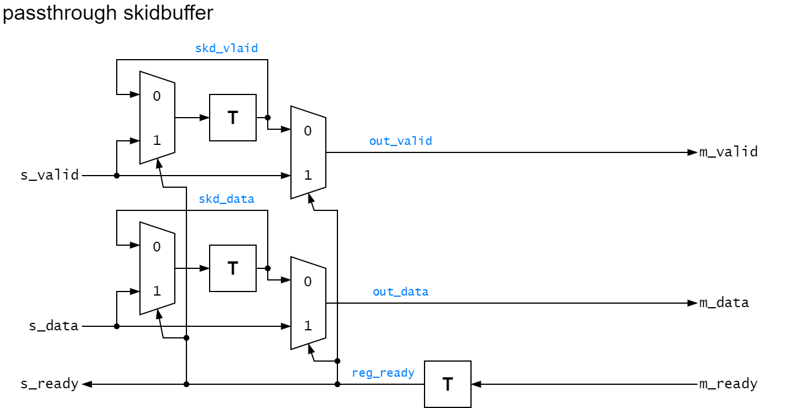
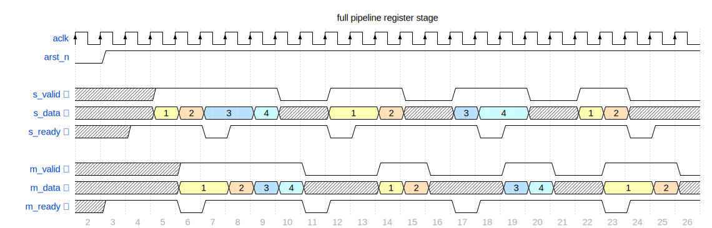
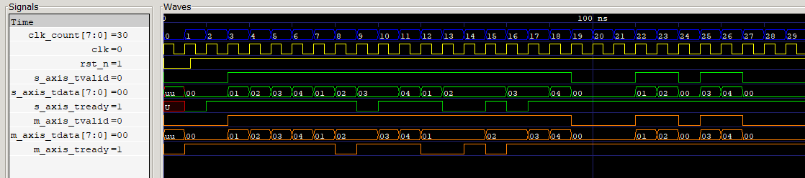
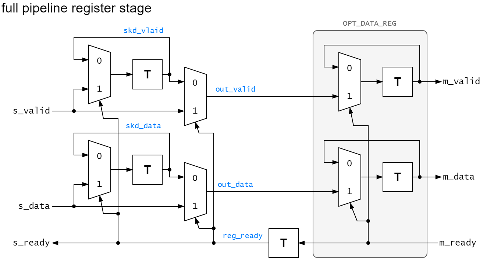
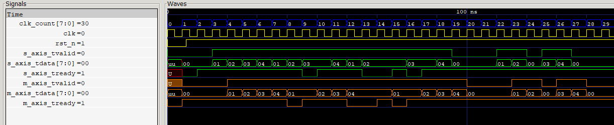
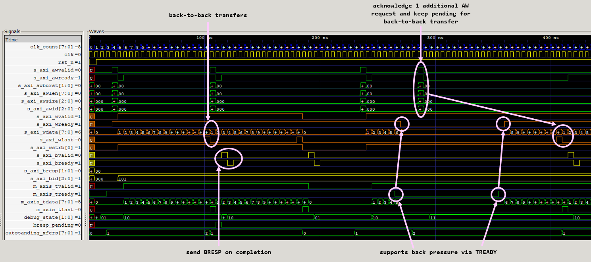
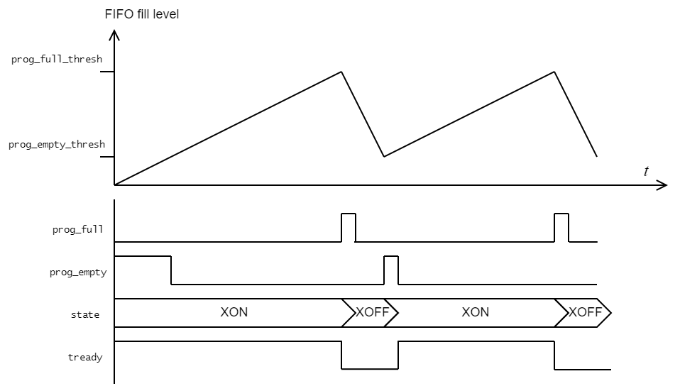

# AXI Stream compatible Skidbuffer in VHDL

---
## Skidbuffer Idea

### Passthrough Skid Buffer

Only the reply signal from downstream slave to upstream master (`tready`) is pipelined.

All other signals from upstream master to downstream slave (`tvalid`, `tdata`, `tlast`) are *combinatorial*.
It therefore has 0 latency in the best case and maximum 1 clock cycle latency in case of a stall.
However, it increases combinatorial logic in the master -> slave path which can make it harder to meet timing requirements.

#### Schematic


#### Waveform



### Fully Pipelined Skid Buffer

With registered outputs for all signals.
It therefore has a minimum latency of 1 clock cycle and a maximum of 2 clock cycles in case of a stall.
This is a pipeline register to help reach timing closure.

#### Schematic


#### Waveform



### Simulation

Assuming `ghdl` and `gtkwave` installed on Windows.

Run in powershell:

```batch
.\compile.bat
```

### Application / Use-Case

A skid buffer is always useful when creating custom bus manipulations.
There it is good practice to insert a register for the manipulated signals to ease timing requirements.
Inserting a register comes with the challenge of breaking up the handshake signal.
Hence, a skidbuffer can serve as a good template to build custom functions.

This repository contains several examples that are described below.

- AXI4 to AXIS converter
- AXIS Buffer Flow Control

---

## AXI4 to AXIS converter

The purpose of the entire project is to build an IP core to convert the AXI4 write channel to AXIS interface.
To achieve this, the incomming AXI4 slave port must be registered. Registering a handshake bus protocol comes with the requirement for a skidbuffer.
See below for the details on the skidbuffer implementation.
Once the skidbuffer is operational, the AXI4 write channel can just be passed to an AXIS master interface (including handshake compatibility with `tready` and `wready` signals).
However, the AXI4 port still requires some additional features like aknowledging requests on the AW channel and sending positive write responses on the B channel (`bresp`). All of this is taken care of in this IP core.

### Features

- accepts `S_AXI4` write request handshakes on AW-channel
	+ accepts up to one additional AW request while a write burst is still in progress allowing for...
	+ back-to-back write transactions
- supports full AXI4 thorughput for burst transfers without wait cycles
- `S_AXI4` W to `M_AXIS` conversion
- supports `tready` backpressure forwarded to upstream `S_AXI4` (both `wready` and `awready`)
- `S_AXI4` write acknowledgement (`bresp` = OK) after burst transfer (after `tlast`)



---
## AXIS Buffer Flow Control (XON/XOFF)

The Xilinx FIFO Generator IP is a buffer which enables (clock domain crossing) dual port access.
There may be a scenario where Ethernet packets are written to the FIFO at a greater speed than the FIFO is read.
This will lead to the FIFO togling between the full and almost full state.
The `tready` signal going to the upstream writing interface will toggle each time the FIFO switches its state.

If the upstream device supports flow control via XON/XOFF signaling, it may be advantageous to keep `tready` low until the FIFO can again receive a burst of data instead of single transations.
For this purpose, the AXI Flow Control IP will take the `prog_full` and `prog_empty` signals and interpret them as toggle triggers for the XON/XOFF state which it then translates to the `tready` signal.



### Features

- inserts a single pipeline stage to an AXIS bus
- a `1` on the `xoff` input will stall the AXIS interface
- a `1` on the `xon` input will free the AXIS interface and enable transactions

---

# Acknowledgements

https://zipcpu.com/blog/2019/05/22/skidbuffer.html


### Anti-Acknowledgements

This article did **NOT** help: it is confusing since the code does not match the schematic.

https://www.itdev.co.uk/blog/pipelining-axi-buses-registered-ready-signals

# Tools

Simulated using GHDL 3.7 / implemented and tested with Xilinx Vivado 2021.2

